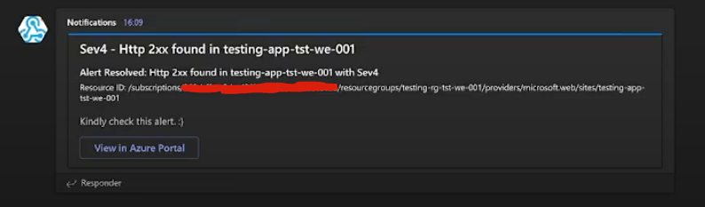

# Azure Alerts Notificator
[](http://unmaintained.tech/)




### What is this?

It's a simple function that allows you to send Azure alerts directly to a Microsoft Teams channel through a webhook.

> :warning: This function was created to be presented on Netcoreconf 2021, so it's not ready to be implemented in a production environment.

### How to use it

1. Create a new webhook in your Microsoft Teams channel.
2. Run initial_setup.ps1 using a Teams Webhook as argument. Kindly check the example below:
```powershell
./initial_setup.ps1 "https://yourorganization.webhook.office.com/webhookb2/xxxxxxxxxxx/IncomingWebhook/xxxxxxxxx/xxxxxxxxx"
```
3. Deploy the function in Azure.